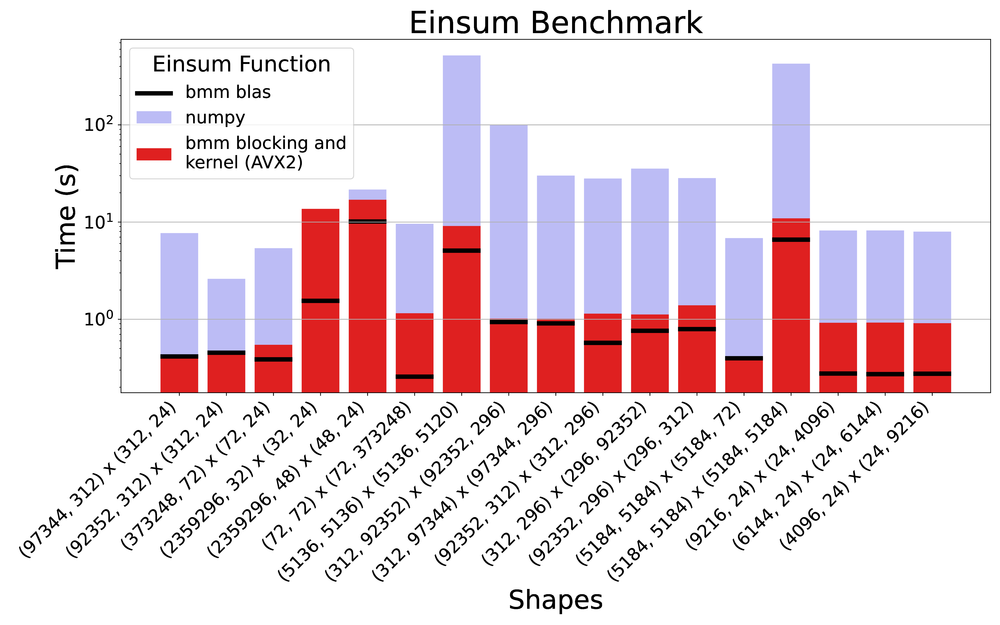

# Fast Einsum with Batch Matrix Multiplication
This repository contains an einsum python library that uses batch matrix multiplication created by
- Sonja Weitzing and
- Erik Henicke
  in the context of the course Algorithm Engineering by Mark Blacher at Friedrich Schiller University Jena.

## Motivation
Einsum is a versatile tool for many multi-linear tensor operations, made popular by NumPy's implementation in 2011. It has great expressive power and is part of major machine learning frameworks such as PyTorch and TensorFlow, leading to its widespread use in deep learning. Since large parts of deep learning are series of matrix multiplications and tensor contractions, they can be easily mapped to einsum expressions.

The approach of reducing tensor contractions to batch matrix multiplication (BMM) is known as [Transpose-Transpose-GEMM-Transpose (TTGT)](http://publications.rwth-aachen.de/record/755345/files/755345.pdf), with the only difference that batch dimensions may be present. The input tensors must be transposed and reshaped so that they can be interpreted as batches of matrices. This allows us to generalize over all contracting einsum expressions. The translation between tensors and matrices relies on the [einsum_bmm](https://github.com/jcmgray/einsum_bmm/blob/main/einsum_bmm.py) approach by Johnnie Gray.

Our main work focuses on implementing a fast BMM in C++ using various optimization techniques — kernelization with AVX2 vector intrinsics, cache-friendly blocking, and OpenMP parallelization — and evaluating it in a comprehensive benchmark. Our optimized implementations outperform NumPy's einsum function by up to 100x for large input shapes.


*Performance comparison of einsum implementations. The benchmark shows significant performance gains of the BMM approach over NumPy's einsum, especially for large input shapes. Benchmark instances are represented by their shapes when interpreted as matrices.*

## Folder structure
- `bmm` contains the `C++` library for batch matrix multiplication.
- `tests` contains the tests for the bmm library.
- `einsum_benchmark` contains the benchmark and tests for the fast einsum library.
- `fast_einsum` contains the python library that uses the `C++` library for batch matrix multiplication.
- `results` contains the results of the benchmarks.
- `plot` contains the scripts to plot the results.

## Installation
The folder `fast_einsum` contains the python einsum library that uses the `C++` library for batch matrix multiplication 
and can be distributed as a python package: `fast_einsum/dist/fast_einsum-0.1.0-py3-none-any.whl`.

Simply install the package via pip:
```bash
pip install fast_einsum-0.1.0-py3-none-any.whl
```

If you want to perform the tests, you can install the package with the test dependencies:
```bash
pip install fast_einsum/dist/fast_einsum-0.1.0-py3-none-any.whl[test]
```
and run the tests from the `fast_einsum` directory:
```bash
pytest tests -v
```

## Support
If any support is needed, we are there to help. Reach out to us under
- erik.henicke@uni-jena.de or
- sonja.marina.weitzing@uni-jena.de
